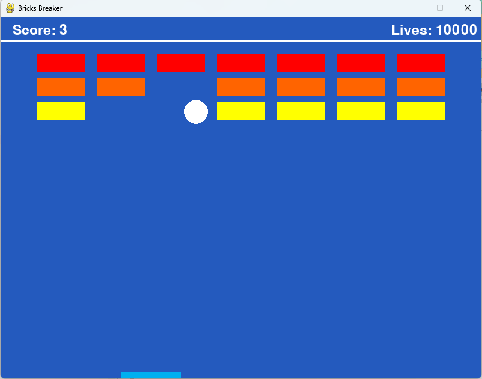

# Reinforcement-Learning-Bricks-Breaker

## AFEKA - Tel-Aviv Academic College Of Engineering<br/>Department: Intelligent Systems<br/>Course: Multi-Agent Systems

---

**Course project:** Development of a Bricks Breaker game controlled by a simple reinforcement learning algorithm.  
The project demonstrates autonomous paddle control based on previous game experience.

**Project Completion Date:** 2024  

**Development Tools:** Python, Pygame, Pandas  

**Main Concepts:**  
Reinforcement learning, state-action tables, environment discretization, autonomous control, game simulation.

---

## Overview

This project implements a simple reinforcement learning algorithm for controlling the paddle in a Bricks Breaker game.

The learning process is based on:
- the current ball location,
- ball movement direction,
- paddle position states,
- previous successful and failed actions.

The RL system learns how to move the paddle in order to intercept the ball automatically without user interaction.

The project includes:
- a complete Bricks Breaker game implementation,
- autonomous paddle control,
- reinforcement learning table generation,
- learning from successes and failures,
- persistent RL data storage using CSV files.

---

## RL Algorithm Idea

The Reinforcement Learning area is defined as the space between the brick area and the paddle area.

The RL area is divided into multiple equal sub-areas.

For every sub-area:
- the ball direction is analyzed,
- paddle states are evaluated,
- successful and failed actions are stored.

Each RL state can have one of three values:
- NOT TESTED
- SUCCESS
- FAILURE

The algorithm workflow:
1. Detect the ball inside the RL area
2. Analyze the ball direction
3. Select a paddle state
4. Test the selected action
5. Update the RL table according to the result

The paddle gradually improves its behavior using accumulated experience from previous episodes.

---

## RL Algorithm Visualization



---

## Main Features

- Fully playable Bricks Breaker game
- Autonomous paddle movement
- Reinforcement learning based control
- State-action RL table
- Ball trajectory analysis
- CSV-based persistence of learning results
- Dynamic learning from failures and successes
- Modular game architecture

---

## Project Structure

```text
├── main.py
├── ball.py
├── brick.py
├── paddle.py
├── settings.py
├── Results.csv
├── algorithm.docx
├── screenshot.png
└── README.md
```

---

## Running the Project

Install dependencies:

```bash
pip install pygame pandas
```

Run the project:

```bash
python main.py
```

---

## Notes

The reinforcement learning mechanism is implemented using:
- discretized environment states,
- ball movement direction analysis,
- paddle state evaluation,
- reward-based updates.

This project was developed as part of an academic course project.
